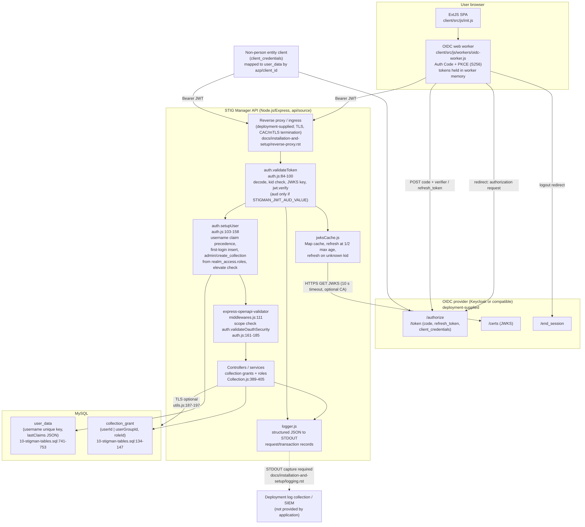
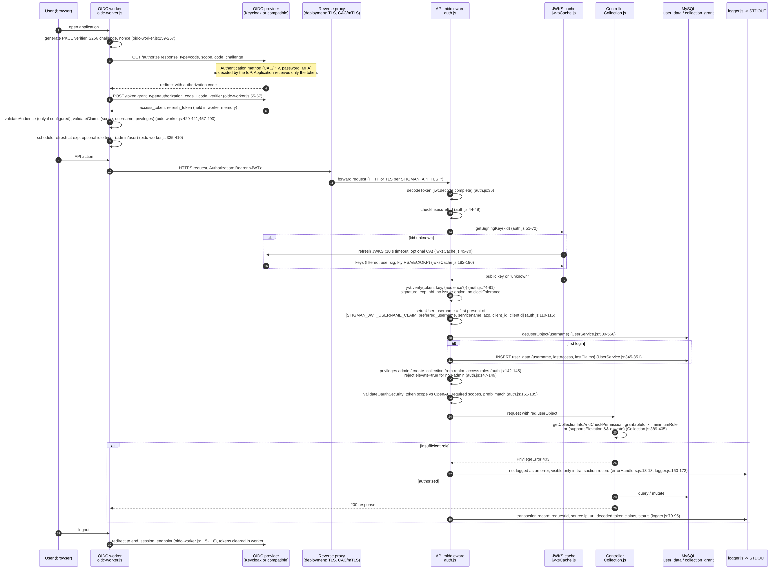
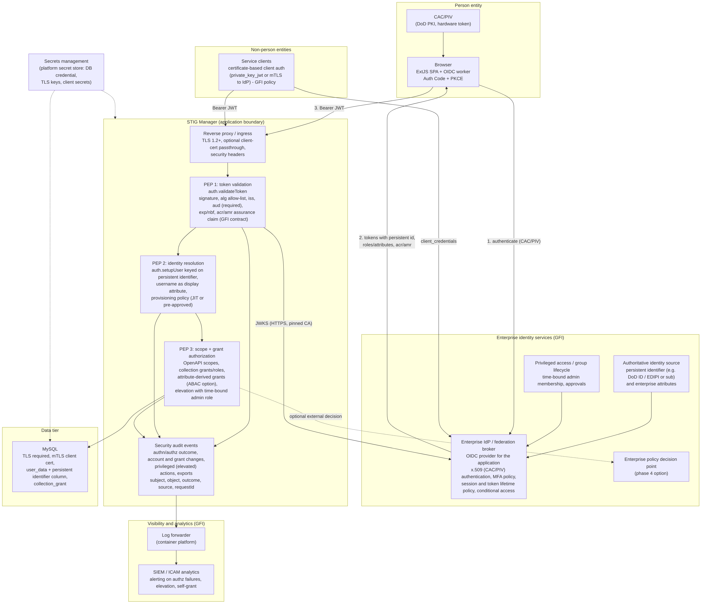

# STIG Manager: ICAM and Zero Trust gap assessment and integration roadmap

CDRL A006 — DAF ICAM Assessment and Integration Roadmap. Source-code assessment of this repository at commit `c0662050`.

## 1. Executive summary

STIG Manager is a Node.js/Express API (`api/source/`) with an ExtJS single-page web client (`client/`) and a MySQL database. It performs no authentication of its own. Every API request must carry an OAuth 2.0 bearer token issued by an OpenID Connect provider; the API verifies the token signature against the provider's JWKS, maps a username claim to a locally stored user record, reads two privilege strings from a configurable claim, and enforces per-operation OAuth scopes plus a four-level collection grant model. The reference provider is Keycloak, but the code depends only on standard OIDC discovery, JWKS and JWT semantics.

The design is compatible with enterprise ICAM federation: authentication is fully delegated, the browser flow is Authorization Code with PKCE (S256), tokens are held in worker memory, and authorization is enforced centrally by the OpenAPI security handler. The gaps are in what the application does *not* check or record:

- **Token trust is under-constrained by default.** Audience validation is optional (`api/source/utils/config.js:96`), issuer is never compared to the token (`api/source/utils/auth.js:74-81`), and there is no explicit accepted-algorithm list (G-01, G-02).
- **Identity is a mutable username, not a persistent identifier.** The local `user_data` record is keyed on `preferred_username` or a client identifier (`api/source/utils/auth.js:110-111`); `sub`, EDIPI or any other stable identifier is not stored (G-05).
- **Privileged access lacks separation of duties.** A single `admin` privilege with `?elevate=true` can grant itself any role in any collection; the documented compensating control is log review (`docs/installation-and-setup/data-and-permissions.rst:189-191`) (G-09).
- **Assurance level is invisible to the application.** The API does not read `acr`, `amr` or `auth_time`, so a CAC-authenticated session and a password session from the same provider are indistinguishable (G-17).
- **Security events are not first-class.** Everything is a generic request/transaction record; logon, privilege change, grant change and export must be reconstructed by URL and status code (G-11).

The register records **26 gaps (4 High, 16 Medium, 6 Low)**, each with the affected component and `file:line`, requirement source, current state, gap, risk, corrective action, responsible Government decision authority, implementation dependency, effort and phase. Four gaps are rated High: G-02 (audience optional), G-05 (username-keyed identity), G-09 (admin self-grant without separation of duties) and G-17 (no assurance-level enforcement or documented CAC path).

DAF-specific ICAM direction is not public. This document states where an assumption has been made in its place (Section 4.3) and marks those rows "Needs Government input" so that Government-furnished direction can replace them without restructuring the assessment.

## 2. System description and as-is identity architecture

### 2.1 Components

- **Web client (ExtJS SPA)** — `client/src/js/`, OIDC worker at `client/src/js/workers/oidc-worker.js`. OIDC public client; Authorization Code + PKCE; holds tokens in a shared worker.
- **API (Express)** — `api/source/`. OAuth 2.0 resource server; JWT validation; user setup; scope and grant enforcement.
- **JWKS cache** — `api/source/utils/jwksCache.js`. Fetches and refreshes provider signing keys.
- **Local user store** — MySQL `user_data`, `collection_grant`, `user_group` (`api/source/service/migrations/sql/current/10-stigman-tables.sql`). Username-keyed user records, grants, groups.
- **OIDC provider** — Deployment-provided (Keycloak in tests: `test/api/mock-keycloak/`). Authenticates users, issues tokens, holds roles/scopes.
- **Reverse proxy / ingress** — Deployment-provided (`docs/installation-and-setup/installation-and-setup.rst:57-62`). TLS termination; required for mTLS/CAC client-certificate authentication.
- **Logging** — STDOUT JSON (`api/source/utils/logger.js`; `docs/installation-and-setup/logging.rst:8`). Request/transaction records; deployment forwards to SIEM.

*Figure 1. As-is component architecture (editable source: `diagrams/as-is-architecture.mmd`).*

### 2.2 Authentication and authorization flow as implemented

The sequence below is derived from the code paths cited in each step.

1. **Discovery and authorization request.** The worker loads the provider's OIDC configuration, refuses providers that do not advertise `S256` when strict PKCE is on (`oidc-worker.js:205`), and redirects with `response_type=code`, a nonce, `code_challenge` and `code_challenge_method=S256` (`oidc-worker.js:267`).
2. **Code exchange and refresh.** The worker exchanges the code with `grant_type=authorization_code` plus `code_verifier`, later refreshing with `grant_type=refresh_token` (`oidc-worker.js:561-563`). It schedules refresh and idle timers from the token `exp` (`oidc-worker.js:335-410`), validates audience only if configured and requires scope, username and privilege claims (`oidc-worker.js:420-421, 457-490`).
3. **Bearer request.** The API middleware chain runs `validateToken` then `setupUser` on every `/api` request (`api/source/bootstrap/middlewares.js:79-80`).
4. **Token validation.** `decodeToken` parses the JWT (`auth.js:36`); `checkInsecureKid` rejects the known test key unless `STIGMAN_DEV_ALLOW_INSECURE_TOKENS=true` (`auth.js:44-49`); `getSigningKey` looks up `kid` in the JWKS cache and refreshes once on a miss (`auth.js:51-60`); `verifyToken` calls `jwt.verify` with only an optional `audience` option (`auth.js:74-81`). Expiry and not-before are enforced by the library; issuer, algorithm list, clock tolerance and maximum age are not configured.
5. **User setup.** The username is the first present claim in `[STIGMAN_JWT_USERNAME_CLAIM, preferred_username, STIGMAN_JWT_SERVICENAME_CLAIM, azp, client_id, clientId]` (`auth.js:110-111`). The user is loaded by username or created on first request (`auth.js:117`; `api/source/service/UserService.js:345-351, 500-556`). Privileges `admin` and `create_collection` are read from the claim path configured by `STIGMAN_JWT_PRIVILEGES_CLAIM`, default `realm_access.roles` (`auth.js:142-145`; `config.js:106-108`). A non-admin sending `?elevate=true` is rejected (`auth.js:147-149`).
6. **Scope enforcement.** The OpenAPI validator calls `validateOauthSecurity` for every operation (`middlewares.js:111`; `auth.js:161-185`). A granted scope satisfies a required scope if equal or if it is a colon-separated prefix (`stig-manager:collection` satisfies `stig-manager:collection:read`).
7. **Grant enforcement.** Collection operations call `getCollectionInfoAndCheckPermission`, which requires a grant at or above the minimum role (Restricted=1, Full=2, Manage=3, Owner=4; `api/source/utils/roles.js`) unless the operation supports elevation and `elevate=true` is present (`api/source/controllers/Collection.js:389-405`).
8. **Logging.** Each request produces a JSON `request`/`transaction` record with `requestId`, time, source IP, method, URL, headers (bearer replaced by `true`, decoded payload attached as `headers.accessToken`), status and operation statistics (`logger.js:62-93, 155-183`). Application security errors are returned to the client and appear only as the transaction status; only non-application errors are written as `error` events (`api/source/bootstrap/errorHandlers.js:13-17`).
9. **Logout.** The worker returns the provider `end_session_endpoint` for redirect (`oidc-worker.js:115-118`). No token revocation call is made.

*Figure 2. Login, token and API authorization sequence as implemented (editable source: `diagrams/auth-sequence.mmd`).*

## 3. Requirement sources

Each source below was opened from the assessment environment and matched to the title cited. The workbook `Sources` sheet records the verification note for each.

- **DoD-ZTS** — DoD Zero Trust Strategy v1.0, 21 Oct 2022 (cleared 7 Nov 2022) — [dodcio.defense.gov](https://dodcio.defense.gov/Portals/0/Documents/Library/DoD-ZTStrategy.pdf). Used for: Seven pillars; Target-level intent.
- **DoD-ZTER** — DoD Zero Trust Capability Execution Roadmap (COA 1), 15 Nov 2022 — [dodcio.defense.gov](https://dodcio.defense.gov/Portals/0/Documents/Library/DoD-ZTExecutionRoadmap.pdf). Used for: Capability and activity names (1.2 Conditional User Access, 1.3 MFA, 1.4 PAM, 1.5 Identity Federation & User Credentialing, 1.7 Least Privileged Access, 1.8 Continuous Authentication, 1.9 Integrated ICAM Platform, 3.4 Resource Authorization & Integration, 7.1 Log All Traffic, 7.2 SIEM).
- **DoD-ICAM-RD** — DoD Enterprise ICAM Reference Design v1.0, June 2020 — [dodcio.defense.gov](https://dodcio.defense.gov/Portals/0/Documents/Cyber/DoD_Enterprise_ICAM_Reference_Design.pdf). Used for: Enterprise IdP, persistent identity, NPE treatment.
- **DoDI-8520.03** — DoDI 8520.03, Identity Authentication for Information Systems, 19 May 2023 — [www.esd.whs.mil](https://www.esd.whs.mil/Portals/54/Documents/DD/issuances/dodi/852003p.pdf). Used for: §3.2 general authentication, §3.3 person entity requirements by risk level, §3.4 NPE, §3.6 IdP requirements.
- **NIST-800-53r5** — NIST SP 800-53 Rev. 5 (Update 1) — [csrc.nist.gov](https://csrc.nist.gov/pubs/sp/800/53/r5/upd1/final). Used for: IA-2/-4/-5/-8, AC-2/-3/-5/-6/-7/-11/-12/-17, AU-2/-3/-6/-12, SC-8/-23.
- **NIST-800-63-4** — NIST SP 800-63-4 Digital Identity Guidelines — [www.nist.gov](https://www.nist.gov/publications/nist-sp-800-63-4-digital-identity-guidelines) (SP 800-63-3 withdrawn 1 Aug 2025). Used for: AAL/FAL concepts; assertion handling.
- **NIST-800-207** — NIST SP 800-207 Zero Trust Architecture — [nvlpubs.nist.gov](https://nvlpubs.nist.gov/nistpubs/SpecialPublications/NIST.SP.800-207.pdf). Used for: Policy engine / policy enforcement point model.
- **ASD-STIG** — DISA Application Security and Development STIG — [www.stigviewer.com](https://www.stigviewer.com/stig/application_security_and_development/). Used for: V-2224xx/V-2225xx/V-2226xx rules cited by ID.
- **DAF-ZT** — DAF Zero Trust Strategy v1.0; DAF Enterprise Zero Trust Roadmap and Release Notes v2.0 (published 23 Oct 2024). Used for: Located by title on the DAF CIO public site; the site could not be resolved from the assessment environment, so no URL is given and no content is cited.
- **DAF-ICAM** — DAF ICAM implementation direction. Used for: Not public; see Section 4.3.

## 4. Assessment by Zero Trust pillar

Counts per pillar are derived from the register data (`scripts/icam_gap_data.py`).

| Pillar | As-is | Target |
|---|---|---|
| **User** (G-04, G-05, G-06, G-07, G-08, G-09, G-14, G-15, G-16, G-17, G-26) | Delegated OIDC authentication; username-keyed identities; two privilege strings; per-request elevation with self-grant; idle timeouts disabled by default | Enterprise IdP with persistent identifier and authentication-context claims; step-up for elevation; enforced session limits; NPEs distinguished |
| **Device** (G-22) | No device identity or posture input; secrets injected by platform | Workload identity from enclave PKI/secrets manager; posture via enterprise conditional access |
| **Applications & Workloads** (G-01, G-02, G-03, G-10, G-18, G-19, G-24) | Scope-per-operation; RBAC grants; signature verification with optional audience; single issuer with local defaults | Explicit alg/iss/aud policy; trusted-issuer list; PEP able to call an enterprise PDP |
| **Data** (G-23) | Exports logged as generic transactions | Export audit events and marking |
| **Network & Environment** (G-20, G-21) | TLS optional for API and database | TLS enforced; certificate identity to database |
| **Automation & Orchestration** (G-25) | Manual status and grant management | Inactivity automation; deprovisioning hook |
| **Visibility & Analytics** (G-11, G-12, G-13) | JSON request logs to STDOUT with full decoded claims | Normalised audit events with PII minimisation; mandatory SIEM forwarding |

### 4.1 User pillar detail

- **Authentication (1.3 MFA, 1.8 Continuous Authentication).** The application relies on assertions. It cannot tell whether the IdP used a CAC/PIV, a software certificate or a password, because `acr`/`amr`/`auth_time` are not read (`auth.js:84-158`) (G-17). Tokens are valid until `exp` with no introspection or revocation (`auth.js:84-100`) (G-04).
- **Identity (1.5 Identity Federation & User Credentialing).** `user_data.username` is UNIQUE and is the join key for grants and audit history; `sub` is unused (`auth.js:110-111`; `10-stigman-tables.sql`) (G-05). Accounts are created implicitly on first request (`UserService.js:351`) (G-06). NPEs share the same table and namespace via `azp`/`client_id`/`clientId` (G-07).
- **Privilege (1.2 Conditional User Access, 1.7 Least Privilege, 1.4 PAM).** Two privileges from a Keycloak-shaped default claim path (`config.js:106-108`) (G-08). Elevation is per request, requires no re-authentication, and permits self-grant (`Collection.js:389-405`; `data-and-permissions.rst:189-191`) (G-09).
- **Session.** Idle timeouts for admin and non-admin exist but default to 0 (`config.js:26-36`; `oidc-worker.js:471-476`) (G-16). PKCE S256 is enforced unless `STIGMAN_CLIENT_STRICT_PKCE=false` (`config.js:45`) (G-15). The worker logs the authorization code, PKCE verifier and full token response to the browser console (`oidc-worker.js:55, 542`) (G-14).

### 4.2 Applications & Workloads detail

- **Token policy (3.4 Resource Authorization & Integration).** `jwt.verify(tokenJWT, signingKey, options)` where `options` is `{audience}` only when `STIGMAN_JWT_AUD_VALUE` is set (`auth.js:75-77`). JWKS keys are filtered to `use=sig` and `kty` RSA/EC/OKP (`jwksCache.js:182-183`), which constrains algorithm families implicitly. Issuer is not checked (G-01, G-02, G-03).
- **JWKS handling.** Cache refresh at half the configured maximum age, refresh on unknown `kid`, stale keys cleared, 10-second fetch timeout, configurable CA certificates (`jwksCache.js:14-17, 45-66, 85, 182-188`). This supports key rotation without restart. No gap recorded.
- **Scope enforcement.** Every operation declares scopes; prefix matching is deliberate (`auth.js:170-178`) (G-10).
- **Configuration.** Defaults point at `http://localhost:8080/realms/stigman` for API, client and OpenAPI UI (`config.js:37, 89, 95`); the OpenAPI document embeds a literal discovery URL (`stig-manager.yaml:10895`) (G-18). A known test signing key is rejected unless a development flag is set (`auth.js:44-49`; `config.js:4, 97-99`) (G-24).
- **Authorization model.** RBAC on local grants with no PDP or attribute input (G-19); see Section 6.

### 4.3 DAF-specific direction

DAF ICAM implementation direction for applications is not publicly available. Public material establishes only that the DAF operates an enterprise authoritative identity data service for Air Force and Space Force personnel, and that the DAF has published a Zero Trust strategy and an enterprise Zero Trust roadmap aligned to the DoD strategy and its seven pillars. Neither the DAF documents nor any DAF ICAM integration specification could be opened from the assessment environment, so no content from them is cited.

This assessment therefore treats the following as assumptions to be replaced by Government-furnished direction:

| Assumption used | Where it applies | Replace with |
|---|---|---|
| The enterprise IdP will issue a persistent identifier (for example `sub` bound to an enterprise record, or EDIPI/DoD ID) in the access token | G-05, G-07 | Furnished assertion profile |
| The enterprise IdP will release group or role attributes suitable for mapping to `admin` and `create_collection` | G-08 | Furnished attribute release list |
| The enterprise IdP will express authentication context (`acr`/`amr`) for CAC/PIV | G-17 | Furnished authentication-context values |
| A single trusted issuer (or a broker) is acceptable | G-18 | Furnished federation topology |
| Log destination and retention will be set by the hosting enclave | G-12 | Furnished SIEM onboarding requirement |

G-26 tracks receipt of this direction as a Phase 0 item.

## 5. Assessment by NIST SP 800-53 Rev. 5 control

Status values: Satisfied / Partially / Not satisfied / Needs Government input. The full crosswalk with evidence is in the workbook `Control-Crosswalk` sheet.

| Control | Status | Evidence summary | Gaps |
|---|---|---|---|
| IA-2 | Partially | Bearer token required on every `/api` request (`auth.js:84-100`); identification by username claim | G-05, G-17 |
| IA-2(1) | Needs Government input | MFA is an IdP property; no `acr`/`amr` check | G-17 |
| IA-2(2) | Needs Government input | As IA-2(1) | G-17 |
| IA-2(12) | Needs Government input | PIV acceptance at IdP/proxy (`installation-and-setup.rst:57-62`) | G-17 |
| IA-4 | Not satisfied | Mutable username is the identifier | G-05 |
| IA-5 | Partially | JWKS rotation handled; no alg/issuer policy; audience optional | G-01, G-02, G-24 |
| IA-8 | Partially | Any IdP identity auto-provisioned | G-06, G-18 |
| IA-9 | Partially | NPE via `azp`; DB client-certificate auth optional (`db.rst:125-136`) | G-07, G-21 |
| AC-2 | Partially | Implicit creation; manual disable; no inactivity automation | G-06, G-25 |
| AC-3 | Satisfied | Scope enforcement on every operation; grant checks | G-10 |
| AC-5 | Not satisfied | Admin self-grant | G-09 |
| AC-6 | Partially | Four-level roles; broad elevation | G-08, G-09, G-10 |
| AC-6(1) | Partially | `admin` + `elevate` required; no step-up | G-09 |
| AC-6(9) | Partially | Elevated bodies logged; no distinct event | G-09, G-11 |
| AC-6(10) | Satisfied | Non-admin elevation rejected (`auth.js:147-148`; `User.js:26`) | — |
| AC-7 | Needs Government input | Logon attempts occur at IdP | G-17 |
| AC-11 | Partially | Idle timeout disabled by default | G-16 |
| AC-12 | Partially | End-session redirect; no revocation | G-04, G-15, G-16 |
| AC-17 | Partially | HTTPS optional in code (`server.js:45-48`) | G-20 |
| AU-2 | Partially | Generic request/transaction events only | G-11, G-23 |
| AU-3 | Partially | Time, source, URL, status present; subject/object/outcome not normalised | G-11, G-13 |
| AU-6 | Needs Government input | Review is a deployment responsibility | G-12 |
| AU-12 | Partially | Central generation; generic event set | G-11 |
| SC-8 | Partially | TLS optional for API and DB | G-20, G-21 |
| SC-23 | Partially | Signed JWT + PKCE; issuer/audience gaps | G-01, G-02, G-03 |

## 6. Identity lifecycle, credentialing and authorization observations

### 6.1 CAC/PIV path

A CAC-authenticated user would flow as follows: browser presents the CAC certificate to the IdP (directly via the IdP's X.509 authenticator or via a reverse proxy that terminates mTLS and forwards the certificate); the IdP validates the certificate path and revocation status, maps the certificate to an IdP user, and issues an OIDC authorization code; the web client exchanges the code with PKCE; the API verifies the resulting token as in Section 2.2. The application's own obligations are: verify the assertion correctly (issuer, audience, algorithm, expiry), key the local identity on a persistent identifier carried in the assertion, and, where the AO requires it, verify the authentication context claim. Today the first is partial (G-01, G-02), the second is absent (G-05), and the third is absent (G-17). Certificate path validation and revocation checking (ASD STIG V-222550, V-222553) are IdP or proxy responsibilities and cannot be assessed from this repository.

### 6.2 NPE and service accounts

Service clients authenticate to the IdP (client credentials) and are mapped to `user_data` rows by `azp`/`client_id`/`clientId` (`auth.js:110-111`). Documentation says the service-name claim defaults to `clientId` (`authentication.rst:28`) while `config.js:104` has no default; behaviour is preserved by the fallback list. DoDI 8520.03 §3.4 expects NPE credentials to be certificate-based for mutually authenticated transactions; the application neither knows nor records how the NPE authenticated (G-07). The API-to-database connection can use X.509 client certificates (`db.rst:125-136`) but defaults to a password (G-21).

### 6.3 Persistent identifier

No column in `user_data` holds `sub`, EDIPI/DoD ID, or a certificate subject. Migration to a persistent identifier requires a schema change and a Government-approved mapping from existing usernames (G-05). Until then, the audit history and grants of two different subjects who share a username across IdP migrations will merge.

### 6.4 RBAC to ABAC

Authorization inputs today are: token scopes, two privilege strings, the local grant table (user or group, role 1-4, optional ACL) and the `elevate` flag. Decisions are made inline in controllers (`Collection.js:389-405`; `User.js:25-26`). ABAC is feasible without redesign by wrapping these checks in a policy enforcement abstraction that can pass token attributes and request context to an external policy decision point and fall back to local RBAC (G-19). Attribute sources (organisation, duty position, clearance, device posture) must come from the enterprise IdP or attribute service, which is a Government dependency.

### 6.5 Least privilege and privileged access

Scopes and roles are fine-grained enough for least privilege if the IdP issues minimum scopes per client (G-10). Privileged access has three weaknesses: no separation between grant administration and content access (self-grant), no step-up authentication for `elevate=true`, and no break-glass definition (G-09). `AC-6(10)` is met: a non-admin cannot elevate (`auth.js:147-148`).

## 7. Auditability observations

What is logged: every request and response as structured JSON with `requestId` (UUID), timestamp, source IP, method, URL, sanitised headers, status, and per-request operation statistics including the local `userId` and `azp` (`logger.js:79-93, 155-183, 276-287`). Elevated requests additionally log full request bodies (`logger.js:91`). Non-application errors are logged with the serialised request (`errorHandlers.js:13-17`). Log-socket authorization failures are logged as `authorize-failed` (`logSocket.js:190-191`).

What is missing against AU-2/AU-3/AU-12: distinct events for successful and failed authentication, failed authorization (scope, privilege, grant), account creation/modification/disable, grant creation/modification/deletion, privilege use, data export, and session events. Subject, object, action and outcome are recoverable from URL, method, status and `userId` but are not normalised fields (G-11). The decoded token payload is attached to every request record (`logger.js:68-69, 81-83`), so every claim the IdP releases is written to the log (G-13). Forwarding, retention and review are unspecified deployment responsibilities although the self-grant control depends on them (G-12).

## 8. Legacy or incompatible patterns and integration risks

| Pattern | Evidence | Effect on enterprise federation | Gap |
|---|---|---|---|
| Username as identity key | `auth.js:110-111`; `10-stigman-tables.sql` | Identity merge/split across IdP migration | G-05 |
| Keycloak-specific default claim path `realm_access.roles` | `config.js:106-108` | Requires IdP claim mapper or reconfiguration | G-08 |
| Single issuer; `localhost` realm defaults; literal discovery URL in OpenAPI | `config.js:37, 89, 95`; `stig-manager.yaml:10895` | No overlap period or multi-IdP; non-production defaults | G-18 |
| Optional audience | `config.js:96` | Cross-client token replay on a shared IdP | G-02 |
| Implicit account creation | `UserService.js:351` | Population equals IdP client population | G-06 |
| Persons and NPEs share namespace | `auth.js:110-111` | Name collision; no NPE credential policy | G-07 |
| Compensating control by log review | `data-and-permissions.rst:189-191` | Depends on unstated SIEM/retention | G-09, G-12 |

Local password accounts, hard-coded realm or client identifiers in code, and embedded credentials were **not** found. The application has no local authentication path.

## 9. Target-state architecture

*Figure 3. Target-state architecture (editable source: `diagrams/target-state-architecture.mmd`).*

The target state keeps the application as an OIDC relying party and resource server and adds:

- **Enterprise IdP federation** (direct or via an approved broker) with CAC/PIV as the primary authenticator, issuing tokens with a persistent identifier, group/role attributes and authentication context.
- **Explicit token policy** in the API: pinned issuer list, mandatory audience, accepted algorithms, lifetime ceiling, optional required `acr`/`amr`.
- **Policy enforcement abstraction** around collection, user and grant checks, able to consult an enterprise policy decision point with enriched attributes and fall back to local RBAC.
- **Privileged access controls**: no self-grant by default, step-up for elevation, break-glass procedure, distinct privilege audit events.
- **Workload identity**: certificate-based API-to-database identity from enclave PKI; secrets from the platform secrets manager; TLS enforced.
- **Audit pipeline**: normalised audit events (subject, object, action, outcome, source) with PII minimisation, forwarded to the enterprise SIEM with defined retention and review.

## 10. Integration roadmap

- **Phase 0 — Mobilise and baseline.** Activities: Receive DAF ICAM direction; confirm resource risk level (DoDI 8520.03 §3.3); confirm approved IdP; agree auditable-event list; stand up test environment with the approved IdP. Dependencies: None. Decision needed: Enterprise ICAM PMO: IdP, assertion profile, attribute release. AO: risk level. ISSM: auditable events. Gaps: G-26.
- **Phase 1 — Harden the existing contract.** Activities: Mandatory audience; explicit algorithms and issuer; secure timeout defaults; audit event type; SIEM baseline; remove console token logging; TLS production mode; insecure-token warning; scope matrix and tests; self-grant policy and step-up design. Dependencies: Phase 0 values for algorithms, issuer, audience, timeouts. Decision needed: ISSM/Program Office: approve changes. AO: accept or reject self-grant compensating control. Gaps: G-01, G-02, G-09, G-10, G-11, G-12, G-14, G-16, G-20, G-24.
- **Phase 2 — Enterprise identity integration.** Activities: Persistent identifier and migration; NPE entity type; privilege mapping from enterprise groups; `acr`/`amr` option; lifetime ceilings; DB mTLS default; secrets-manager reference deployment; log PII minimisation; export events. Dependencies: Phase 1; enterprise test realm; enclave PKI. Decision needed: Enterprise ICAM PMO: identifier and group standard. AO: migration risk. Privacy Officer: log attributes. Gaps: G-03, G-04, G-05, G-06, G-07, G-08, G-13, G-15, G-17, G-21, G-22, G-23.
- **Phase 3 — Policy externalisation and federation.** Activities: PEP abstraction with optional PDP; trusted-issuer list; inactivity automation and deprovisioning hook; remove local defaults from production images. Dependencies: Phase 2 attribute mapping; PDP reachable. Decision needed: Enterprise ICAM PMO: PDP pattern and topology. Gaps: G-18, G-19, G-25.
- **Phase 4 — Validate and authorise.** Activities: Execute test plan in the Government-approved environment; SIEM rule validation; ATO evidence; residual-risk acceptance. Dependencies: Phases 1-3 in test. Decision needed: AO: authorisation and residual risk. ISSM: witness. Gaps: —.

## 11. Test planning and validation approach

Testing of ICAM functions must occur in a Government-approved environment with the approved IdP; the repository's mock provider (`test/api/mock-keycloak/`) is suitable only for regression of application logic.

| Area | Test | Expected result | Evidence |
|---|---|---|---|
| Token validation | Tokens with wrong `iss`, wrong `aud`, unexpected `alg`, expired, `nbf` in future, unknown `kid`, known insecure `kid` | 401 with no user record created; audit event `authn-rejected` | API unit tests (`test/unit`), API tests (`test/api`) |
| Key rotation | Rotate IdP signing key; request with new `kid` | JWKS refresh on miss; request succeeds; old key removed after stale period | API log `jwksCache` events |
| Identity mapping | Same person with changed `preferred_username`; NPE client with name equal to a person | Single identity keyed on persistent identifier; no merge | DB inspection |
| CAC path | Authenticate with CAC at IdP; authenticate with password (if enabled) | API accepts only assertions carrying the required `acr`/`amr` when configured | Audit event includes authentication context |
| Privilege | Non-admin with `elevate=true`; admin self-grant with policy on and off; step-up expired | 403 / denied / re-authentication required | Audit event `privilege-change`, `authz-denied` |
| Scope | Client with only `stig-manager:collection:read` calls write operation | 403 `OutOfScopeError` | API test |
| Session | Idle beyond configured limit; refresh token expired; logout | Client clears tokens; API rejects after `exp`; end-session invoked | Browser test, API log |
| Audit | Execute each auditable event; forward to SIEM | Event parsed with subject, object, action, outcome, source | SIEM query |
| Transport | Start API without TLS in production mode; DB without TLS | Startup refused unless explicit override | Startup log |

## 12. Risks and residual risks

- **Token acceptance across relying parties** until audience is mandatory (G-02): High until Phase 1 completes.
- **Identity merge across IdP migration** until a persistent identifier is stored (G-05): High during any IdP migration; requires the Government mapping decision.
- **Admin self-grant** (G-09): High until either the policy change ships or the AO formally accepts log review as the control, with SIEM forwarding and review in place (G-12).
- **Assurance-level blindness** (G-17): High for moderate/high-risk resources until the IdP profile is furnished and the API can require the context claim.
- **Residual after roadmap**: token validity window between IdP revocation and `exp` (G-04) unless introspection is adopted; reliance on IdP for account lifecycle (G-06, G-25); PII in logs limited to the agreed subject block (G-13); deployment-dependent TLS termination point (G-20).

## 13. Decisions requiring Government approval

| # | Decision | Authority | Blocks |
|---|---|---|---|
| D1 | Furnish DAF ICAM integration direction: approved IdP, client registration, assertion profile (persistent identifier, groups, `acr`/`amr`), attribute release, log destination | Enterprise ICAM PMO | G-05, G-08, G-17, G-18, G-26 |
| D2 | Resource risk level for STIG Manager data under DoDI 8520.03 §3.3 (drives authenticator requirements) | AO | G-17 |
| D3 | Accept or reject "elevated-request log review" as the compensating control for admin self-grant; if rejected, approve the no-self-grant and step-up design | AO | G-09, G-12 |
| D4 | Approved signing algorithms, issuer strings and audience values per environment | ISSM / IdP owner | G-01, G-02 |
| D5 | Session and token lifetime values (idle, access, refresh, maximum age) | AO / ISSM | G-03, G-16 |
| D6 | Auditable event list (AU-2) and log attribute set (PII) | ISSM / Privacy Officer | G-11, G-13 |
| D7 | Persistent identifier choice and migration mapping for existing usernames | Enterprise ICAM PMO / AO | G-05, G-07 |
| D8 | Federation topology (direct enterprise IdP vs. broker; single vs. multiple issuers) | Enterprise ICAM PMO | G-18 |
| D9 | Enterprise PDP/attribute service availability for ABAC | Enterprise ICAM PMO | G-19 |
| D10 | TLS termination point and database certificate identity | ISSM / hosting owner | G-20, G-21, G-22 |

## Appendix A. Artifact index

- `ICAM-ZT-Gap-Register.xlsx` — sheets `Gaps`, `Control-Crosswalk`, `ZT-Pillar-Summary`, `Roadmap`, `Method`, `Sources`; generated from `scripts/icam_gap_data.py` by `scripts/icam_gap_register.py`.
- `diagrams/*.mmd` and `diagrams/*.png` — editable Mermaid sources and rendered images for Figures 1-3.
- `README.md` — regeneration instructions.
